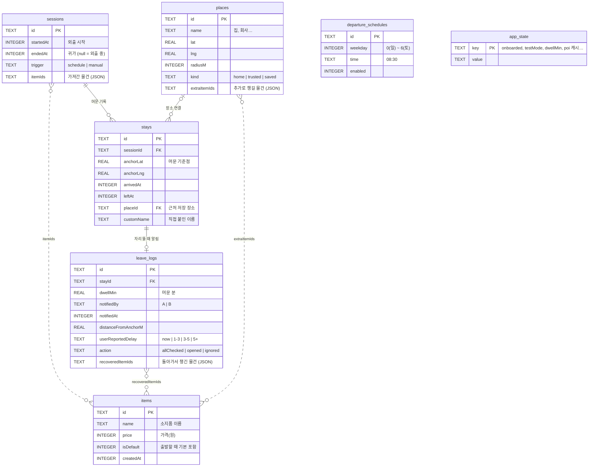
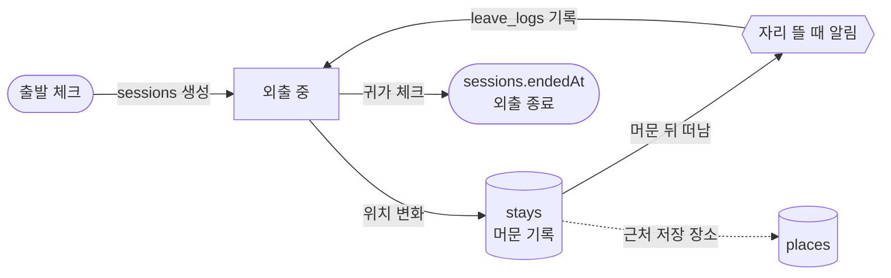
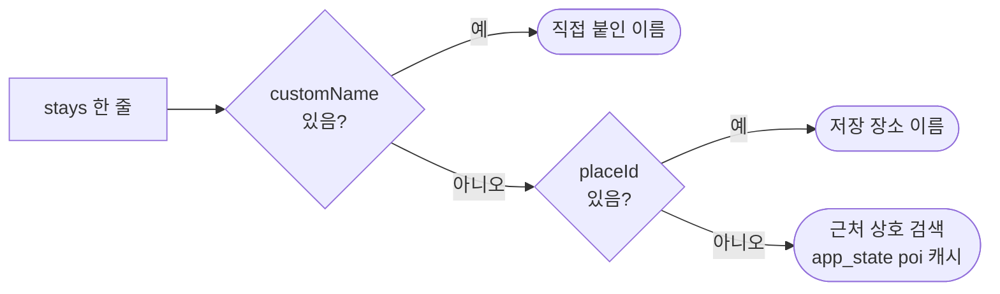

# 챙김

## 저장 구조

모든 데이터는 기기 안의 SQLite 파일 `chaengkim.db` 하나에 저장됩니다.

```mermaid
erDiagram
    items {
        TEXT id PK
        TEXT name "소지품 이름"
        INTEGER price "가격(원)"
        INTEGER isDefault "출발할 때 기본 포함"
        INTEGER createdAt
    }
    sessions {
        TEXT id PK
        INTEGER startedAt "외출 시작"
        INTEGER endedAt "귀가 (null = 외출 중)"
        TEXT trigger "schedule | manual"
        TEXT itemIds "가져간 물건 (JSON)"
    }
    stays {
        TEXT id PK
        TEXT sessionId FK
        REAL anchorLat "머문 기준점"
        REAL anchorLng
        INTEGER arrivedAt
        INTEGER leftAt
        TEXT placeId FK "근처 저장 장소"
        TEXT customName "직접 붙인 이름"
    }
    leave_logs {
        TEXT id PK
        TEXT stayId FK
        REAL dwellMin "머문 분"
        TEXT notifiedBy "A | B"
        INTEGER notifiedAt
        REAL distanceFromAnchorM
        TEXT userReportedDelay "now | 1-3 | 3-5 | 5+"
        TEXT action "allChecked | opened | ignored"
        TEXT recoveredItemIds "돌아가서 챙긴 물건 (JSON)"
    }
    places {
        TEXT id PK
        TEXT name "집, 회사…"
        REAL lat
        REAL lng
        INTEGER radiusM
        TEXT kind "home | trusted | saved"
        TEXT extraItemIds "추가로 챙길 물건 (JSON)"
    }
    departure_schedules {
        TEXT id PK
        INTEGER weekday "0(일) ~ 6(토)"
        TEXT time "08:30"
        INTEGER enabled
    }
    app_state {
        TEXT key PK "onboarded, testMode, dwellMin, poi 캐시…"
        TEXT value
    }

    sessions ||--o{ stays : "머문 기록"
    stays ||--o| leave_logs : "자리 뜰 때 알림"
    places |o--o{ stays : "장소 연결"
    sessions }o..o{ items : "itemIds"
    leave_logs }o..o{ items : "recoveredItemIds"
    places }o..o{ items : "extraItemIds"
```

## 외출 한 번의 흐름

```mermaid
flowchart LR
    A([출발 체크]) -->|sessions 생성| B[외출 중]
    B -->|위치 변화| C[(stays<br/>머문 기록)]
    C -->|머문 뒤 떠남| D{{자리 뜰 때 알림}}
    D -->|leave_logs 기록| B
    C -.->|근처 저장 장소| P[(places)]
    B -->|귀가 체크| E([sessions.endedAt<br/>외출 종료])
```

## 머문 곳 이름 정하는 순서

```mermaid
flowchart LR
    S[stays 한 줄] --> N1{customName<br/>있음?}
    N1 -->|예| R([직접 붙인 이름])
    N1 -->|아니오| N2{placeId<br/>있음?}
    N2 -->|예| R2([저장 장소 이름])
    N2 -->|아니오| R3([근처 상호 검색<br/>app_state poi 캐시])
```
